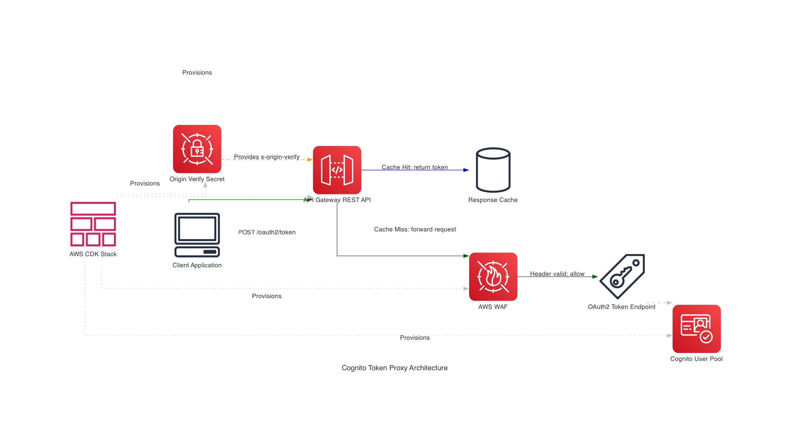
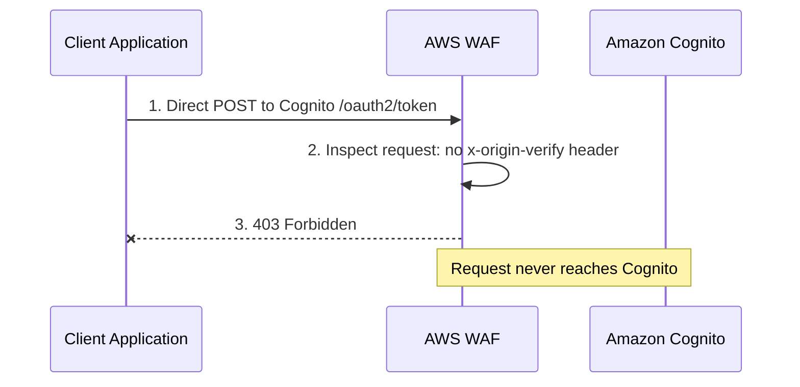
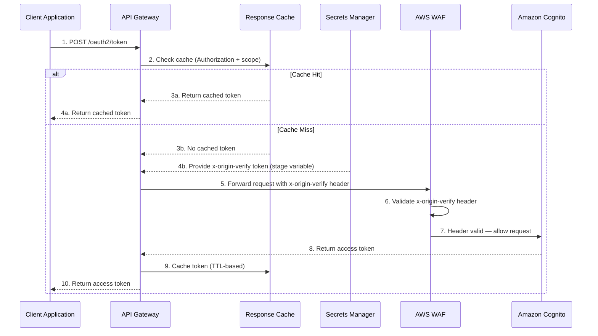

# Amazon Cognito OAuth2 Token Proxy with Caching

An Amazon API Gateway proxy for Amazon Cognito's OAuth2 token endpoint that adds intelligent caching, reducing costs, improving performance, and scaling machine-to-machine (M2M) authentication scenarios.

This repository provides a deployable implementation of the architecture described in the AWS Security Blog post: [How to monitor, optimize, and secure Amazon Cognito machine-to-machine authorization](https://aws.amazon.com/blogs/security/how-to-monitor-optimize-and-secure-amazon-cognito-machine-to-machine-authorization/).

## Table of Contents

- [Architecture](#architecture)
  - [Full Architecture](#full-architecture)
  - [Request Flow — Direct Access Blocked](#request-flow--direct-access-blocked)
  - [Request Flow — Via API Gateway](#request-flow--via-api-gateway)
  - [Components](#components)
- [Usage](#usage)
  - [Authentication Methods](#authentication-methods)
  - [Response Format](#response-format)
  - [Testing](#testing)
  - [Monitoring](#monitoring)
  - [Security Best Practices](#security-best-practices)
- [Prerequisites](#prerequisites)
- [Deployment](#deployment)
  - [Deploy with AWS CDK (Recommended)](#deploy-with-aws-cdk-recommended)
  - [Deploy with CloudFormation (Advanced — Without WAF)](#deploy-with-cloudformation-advanced--without-waf)
- [Accessing the Application](#accessing-the-application)
- [Remove the Application](#remove-the-application)
- [Contributing](#contributing)
- [License](#license)

## Architecture

The solution deploys an Amazon API Gateway REST API that proxies requests to Amazon Cognito's OAuth2 token endpoint, with caching, WAF protection, and a Secrets Manager-based origin-verify mechanism.

### Full Architecture



The architecture consists of the following components working together. Client applications send OAuth2 token requests to an Amazon API Gateway REST API (Regional endpoint), which acts as a proxy in front of Amazon Cognito. Before forwarding a request to Cognito, API Gateway checks its built-in response cache, keyed on both the Authorization header and the scope query parameter. On a cache hit, the cached token is returned immediately without contacting Cognito, reducing both latency and cost. On a cache miss, API Gateway injects a secret `x-origin-verify` header (sourced from Secrets Manager via a stage variable) and forwards the client credentials grant request through AWS WAF to the Cognito User Pool's `/oauth2/token` endpoint. WAF validates the origin-verify header and blocks any request that doesn't include it, preventing direct access to Cognito. The response is cached for the configured TTL and returned to the caller. The entire infrastructure is deployed via AWS CDK.

#### Cost Reduction Example

Consider an application that requests a new access token every 5 minutes (12 times per hour). With a 1-hour token expiration and this caching solution:

- **Without caching**: 12 Cognito API calls per hour = 288 calls per day per application
- **With caching**: 1 Cognito API call per hour = 24 calls per day per application
- **Reduction**: 91.7% fewer Cognito API calls

For 100 applications making similar requests:
- **Without caching**: 28,800 Cognito calls per day
- **With caching**: 2,400 Cognito calls per day
- **Monthly savings**: ~792,000 fewer Cognito API calls

This reduction in M2M token requests translates directly into cost savings. For current pricing details, see the [Amazon Cognito pricing page](https://aws.amazon.com/cognito/pricing/).

### Request Flow — Direct Access Blocked

When a client tries to access Cognito directly (bypassing API Gateway), WAF blocks the request:



### Request Flow — Via API Gateway

When a client goes through API Gateway, the origin-verify header is injected and WAF allows the request:



### Components

- **Amazon API Gateway**: Regional REST API with `/oauth2/token` endpoint that proxies requests to Cognito
- **API Gateway Cache**: Configurable cache cluster (0.5GB - 237GB) with TTL-based expiration for storing tokens
- **AWS WAF**: WebACL that validates a custom origin-verify header before allowing direct Cognito access
- **Amazon Cognito User Pool**: OAuth2 token endpoint for client credentials flow
- **AWS Secrets Manager**: Stores the origin-verify secret used by API Gateway and WAF
- **CloudWatch Logs**: Access logging for API Gateway requests
- **AWS X-Ray**: Distributed tracing for request monitoring

## Usage

### Authentication Methods

The proxy supports three methods for providing OAuth2 credentials:

#### Method 1: Authorization Header (Recommended)

```bash
curl -X POST "https://API_ID.execute-api.REGION.amazonaws.com/STAGE/oauth2/token" \
  -H "Content-Type: application/x-www-form-urlencoded" \
  -H "Authorization: Basic $(echo -n 'CLIENT_ID:CLIENT_SECRET' | base64)" \
  -d "grant_type=client_credentials&scope=your/scope"
```

#### Method 2: Request Body Parameters

```bash
curl -X POST "https://API_ID.execute-api.REGION.amazonaws.com/STAGE/oauth2/token" \
  -H "Content-Type: application/x-www-form-urlencoded" \
  -d "grant_type=client_credentials&client_id=CLIENT_ID&client_secret=CLIENT_SECRET&scope=your/scope"
```

#### Method 3: Query Parameters

```bash
curl -X POST "https://API_ID.execute-api.REGION.amazonaws.com/STAGE/oauth2/token?client_id=CLIENT_ID&client_secret=CLIENT_SECRET&scope=your%2Fscope" \
  -H "Content-Type: application/x-www-form-urlencoded" \
  -d "grant_type=client_credentials"
```

The scope can be passed in the request body (methods 1 and 2) or as a query string parameter (method 3). When using method 3, the scope value must be URL-encoded in the query string. The cache isolates tokens by both credentials and scope, so different scopes produce different cached tokens.

### Response Format

Successful requests return a JSON response:

```json
{
  "access_token": "eyJraWQiOiJ...",
  "expires_in": 3600,
  "token_type": "Bearer"
}
```

### Testing

For comprehensive testing instructions, including tests for API Gateway and WAF protection validation, see the [Testing Guide](docs/testing-guide.md).

### Monitoring

Monitor the solution using Amazon CloudWatch metrics:

- **CacheHitCount / CacheMissCount**: Measure cache effectiveness
- **Count**: Total number of requests
- **Latency**: Response times
- **4XXError / 5XXError**: Error rates

```bash
# Cache hits
aws cloudwatch get-metric-statistics \
  --namespace AWS/ApiGateway \
  --metric-name CacheHitCount \
  --dimensions Name=ApiName,Value=CognitoAuthProxy \
  --start-time $(date -u -v-1H +%Y-%m-%dT%H:%M:%S)Z \
  --end-time $(date -u +%Y-%m-%dT%H:%M:%S)Z \
  --period 300 \
  --statistics Sum \
  --profile YOUR_AWS_PROFILE

# Cache misses
aws cloudwatch get-metric-statistics \
  --namespace AWS/ApiGateway \
  --metric-name CacheMissCount \
  --dimensions Name=ApiName,Value=CognitoAuthProxy \
  --start-time $(date -u -v-1H +%Y-%m-%dT%H:%M:%S)Z \
  --end-time $(date -u +%Y-%m-%dT%H:%M:%S)Z \
  --period 300 \
  --statistics Sum \
  --profile YOUR_AWS_PROFILE

# Average latency
aws cloudwatch get-metric-statistics \
  --namespace AWS/ApiGateway \
  --metric-name Latency \
  --dimensions Name=ApiName,Value=CognitoAuthProxy \
  --start-time $(date -u -v-1H +%Y-%m-%dT%H:%M:%S)Z \
  --end-time $(date -u +%Y-%m-%dT%H:%M:%S)Z \
  --period 300 \
  --statistics Average \
  --profile YOUR_AWS_PROFILE
```

### Security Best Practices

This solution implements multiple security layers: HTTPS-only traffic, encrypted cache at rest, regional endpoints, WAF protection, access logging, and X-Ray tracing.

- Enable AWS CloudTrail logging for API Gateway
- Monitor API Gateway metrics in Amazon CloudWatch
- Set appropriate cache TTL based on your token expiration time
- Implement a scheduled rotation of the origin-verify secret stored in Secrets Manager. When rotating, update the WAF rule to accept both the old and new secret values during the transition, then update the API Gateway stage variable with the new value, and finally remove the old value from the WAF rule

## Prerequisites

Before you deploy this solution, you must have the following:

- An [AWS account](https://aws.amazon.com/premiumsupport/knowledge-center/create-and-activate-aws-account/)
- An Amazon Cognito User Pool with OAuth2 client credentials configured
- A Cognito domain (Amazon Cognito managed domain)
- [AWS CLI](https://docs.aws.amazon.com/cli/latest/userguide/getting-started-install.html) version 2.x or later, configured with appropriate credentials
- For CDK deployment (recommended):
  - [Python](https://www.python.org/downloads/) >= 3.8
  - [Node.js](https://nodejs.org/) >= 20.x
  - [AWS CDK CLI](https://docs.aws.amazon.com/cdk/v2/guide/getting-started.html) >= 2.x (`npm install -g aws-cdk`)

## Deployment

> **Important**: You are responsible for the cost of the AWS services used while running this sample deployment. There is no additional cost for using this sample. For full details, see the pricing pages for each AWS service you will be using in this sample. Prices are subject to change.
>
> - [Amazon API Gateway pricing](https://aws.amazon.com/api-gateway/pricing/)
> - [Amazon Cognito pricing](https://aws.amazon.com/cognito/pricing/)
> - [AWS WAF pricing](https://aws.amazon.com/waf/pricing/)

### Deploy with AWS CDK (Recommended)

The CDK deployment is the recommended method. It deploys the full solution including WAF protection to prevent direct access to Cognito. API Gateway injects a secret `x-origin-verify` header (stored in Secrets Manager) into every proxied request, and WAF blocks any request to Cognito that doesn't include it.

#### Step 1: Clone the repository

```bash
git clone https://github.com/aws-samples/sample-cognito-m2m-token-cache-on-aws.git
cd sample-cognito-m2m-token-cache-on-aws
```

#### Step 2: Set up the Python virtual environment

```bash
cd cdk
python3 -m venv .venv
source .venv/bin/activate  # On Windows: .venv\Scripts\activate
pip install -r requirements.txt
```

#### Step 3: Bootstrap CDK (first time only)

If this is the first time deploying CDK in your account/region, you need to bootstrap the CDK toolkit:

```bash
cdk bootstrap aws://ACCOUNT/REGION --profile YOUR_AWS_PROFILE
```

This creates the S3 bucket and IAM roles that CDK needs to deploy stacks. You only need to do this once per account/region combination.

#### Step 4: Configure and deploy

```bash
cdk deploy \
  --profile YOUR_AWS_PROFILE \
  -c cognito_domain=YOUR_COGNITO_DOMAIN.auth.REGION.amazoncognito.com \
  -c cognito_user_pool_arn=arn:aws:cognito-idp:REGION:ACCOUNT:userpool/POOL_ID \
  -c stage_name=dev \
  -c cache_ttl_seconds=3600 \
  -c cache_size_gb=0.5 \
  --outputs-file ../cdk-outputs.json
```

Replace the following values:
- `YOUR_AWS_PROFILE`: Your AWS CLI profile name
- `YOUR_COGNITO_DOMAIN`: Your Cognito domain without `https://`
- `REGION`: Your AWS region (for example, `us-east-1`)
- `ACCOUNT`: Your AWS account ID
- `POOL_ID`: Your Cognito User Pool ID

The deployment takes approximately 2-3 minutes. After deployment completes, the stack outputs include:
- `ApiEndpointOutput`: The API Gateway endpoint URL
- `WebACLOutput`: The WAF WebACL ARN

**Note**: The WAF association with Cognito may take 5-10 minutes to propagate after deployment.

### Deploy with CloudFormation (Advanced — Without WAF)

A standalone CloudFormation template (`cognito-proxy-template.yaml`) is provided for users who already have an existing WAF deployment or prefer to manage WAF separately. This template deploys only the API Gateway caching proxy — it does not include WAF protection. You are responsible for configuring WAF to block direct access to your Cognito User Pool.

> **Warning**: Without WAF protection, clients can bypass the proxy and call Cognito directly, defeating the purpose of caching. Only use this option if you have an existing WAF setup that you will configure to protect your Cognito endpoint.

#### Step 1: Validate the template

```bash
aws cloudformation validate-template \
  --template-body file://cognito-proxy-template.yaml \
  --profile YOUR_AWS_PROFILE
```

#### Step 2: Deploy the stack

```bash
aws cloudformation deploy \
  --template-file cognito-proxy-template.yaml \
  --stack-name cognito-oauth-proxy \
  --capabilities CAPABILITY_IAM \
  --parameter-overrides \
    CognitoDomain=YOUR_COGNITO_DOMAIN.auth.REGION.amazoncognito.com \
    StageName=dev \
    CacheTtlInSeconds=3600 \
    CacheSize=0.5 \
  --profile YOUR_AWS_PROFILE
```

#### Step 3: Get stack outputs

```bash
aws cloudformation describe-stacks \
  --stack-name cognito-oauth-proxy \
  --query 'Stacks[0].Outputs' \
  --profile YOUR_AWS_PROFILE
```

## Accessing the Application

After deployment, retrieve the API endpoint from the stack outputs:

1. The `ApiEndpointOutput` provides the URL: `https://<API_ID>.execute-api.<REGION>.amazonaws.com/<STAGE>/oauth2/token`
2. Send a token request using any of the [authentication methods](#authentication-methods) described above.

For detailed testing scenarios, see the [Testing Guide](docs/testing-guide.md).

## Remove the Application

To avoid incurring future charges, delete the resources created by this solution.

### Delete the CDK Stack

```bash
cd cdk
cdk destroy --profile YOUR_AWS_PROFILE
```

**Note**: You may need to manually disassociate the WAF WebACL from the Cognito User Pool before deletion:

```bash
aws wafv2 disassociate-web-acl \
  --resource-arn arn:aws:cognito-idp:REGION:ACCOUNT:userpool/POOL_ID \
  --profile YOUR_AWS_PROFILE \
  --region REGION
```

### Delete the CloudFormation Stack

```bash
aws cloudformation delete-stack \
  --stack-name cognito-oauth-proxy \
  --profile YOUR_AWS_PROFILE
```

## Contributing

Contributions are welcome! Please read the [CONTRIBUTING.md](CONTRIBUTING.md) file for guidelines on how to contribute to this project. See the [Code of Conduct](CODE_OF_CONDUCT.md) for community standards.

## License

This library is licensed under the MIT-0 License. See the [LICENSE](LICENSE) file for details.
