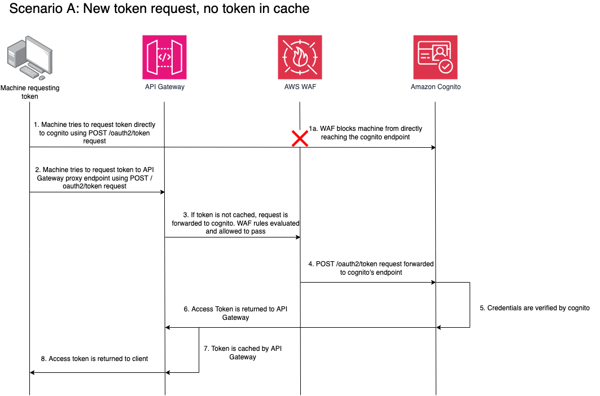
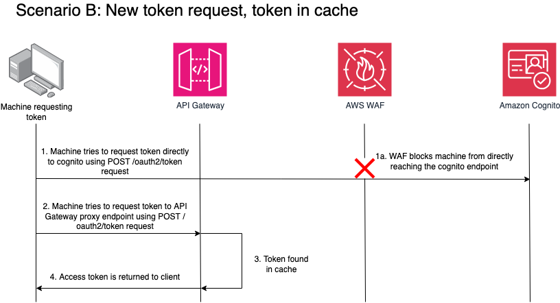

# Amazon Cognito OAuth2 Token Proxy with Caching

This solution provides an Amazon API Gateway proxy in front of Amazon Cognito's OAuth2 token endpoint, adding intelligent caching and API key-based access control. By caching OAuth2 access tokens at the API Gateway layer, this solution significantly reduces the number of requests to Amazon Cognito, resulting in lower costs, improved performance, and better scalability for machine-to-machine (M2M) authentication scenarios.

## What This Solution Does

In typical M2M authentication scenarios, applications frequently request OAuth2 access tokens from Amazon Cognito. Each request to Cognito incurs API costs and adds latency. This solution addresses these challenges by:

1. **Intercepting Token Requests**: API Gateway sits between your applications and Cognito, intercepting all OAuth2 token requests
2. **Intelligent Caching**: Valid tokens are cached at the API Gateway layer based on the Authorization header, eliminating redundant Cognito calls
3. **Automatic Cache Management**: Cached tokens are automatically invalidated based on configurable TTL (time-to-live) settings
4. **Access Control**: API key authentication ensures only authorized applications can request tokens
5. **Optional WAF Protection**: AWS WAF can be enabled to prevent unauthorized direct access to your Cognito User Pool

## Cost Reduction Scenario

Consider an application that requests a new access token every 5 minutes (12 times per hour). With a 1-hour token expiration and this caching solution:

- **Without caching**: 12 Cognito API calls per hour = 288 calls per day per application
- **With caching**: 1 Cognito API call per hour = 24 calls per day per application
- **Reduction**: 91.7% fewer Cognito API calls

For 100 applications making similar requests:
- **Without caching**: 28,800 Cognito calls per day
- **With caching**: 2,400 Cognito calls per day
- **Monthly savings**: ~792,000 fewer Cognito API calls

At Cognito's pricing of $0.0055 per API call (after free tier), this represents significant cost savings while also improving response times through cache hits (typically <10ms vs 100-200ms for Cognito calls).

## Table of Contents

- [Architecture](#architecture)
- [Features](#features)
- [Prerequisites](#prerequisites)
- [Deployment](#deployment)
  - [Cost Considerations](#cost-considerations)
  - [Deploy with AWS CDK](#deploy-with-aws-cdk)
  - [Deploy with CloudFormation](#deploy-with-cloudformation)
- [Usage](#usage)
  - [Authentication Methods](#authentication-methods)
  - [Testing the Deployment](#testing-the-deployment)
- [Security](#security)
- [Monitoring](#monitoring)
- [Cleanup](#cleanup)
- [Additional Resources](#additional-resources)
- [Contributing](#contributing)
- [License](#license)

## Architecture

The solution deploys an Amazon API Gateway REST API that proxies requests to Amazon Cognito's OAuth2 token endpoint. The proxy adds a caching layer to reduce latency and Cognito API calls, and requires API key authentication for access control.

### Architecture Diagram



The diagram above illustrates the basic architecture without WAF protection. The request flow is:

1. **Client Application** sends an OAuth2 token request to the API Gateway endpoint with an API key
2. **API Gateway** validates the API key and checks its cache for a valid token
3. **Cache Hit**: If a valid cached token exists, API Gateway returns it immediately (typically <10ms)
4. **Cache Miss**: If no cached token exists, API Gateway forwards the request to Cognito
5. **Amazon Cognito** validates the client credentials and returns an access token
6. **API Gateway** caches the token based on the Authorization header and returns it to the client
7. Subsequent requests with the same credentials receive the cached token until TTL expires

### Architecture with WAF Protection



When WAF protection is enabled, an additional security layer is added:

1. **AWS WAF WebACL** is associated with the Cognito User Pool
2. **Direct Cognito Access** is blocked by default unless the request includes the correct API key
3. **API Gateway** forwards requests to Cognito with the API key header
4. **WAF Validation** checks the `x-api-key` header value before allowing the request to reach Cognito
5. **Unauthorized Requests** receive a 403 Forbidden response with a descriptive error message
6. **Authorized Requests** (with correct API key) proceed to Cognito for token generation

This architecture ensures that:
- Only requests through API Gateway (with valid API key) can access Cognito
- Direct access to Cognito is prevented, enforcing centralized access control
- All token requests benefit from caching, regardless of the authentication method used

### Components

- **Amazon API Gateway**: Regional REST API with `/oauth2/token` endpoint that proxies requests to Cognito
- **API Gateway Cache**: Configurable cache cluster (0.5GB - 237GB) with TTL-based expiration for storing tokens
- **API Key**: Required for all requests to the proxy endpoint, managed through API Gateway usage plans
- **AWS WAF (Optional)**: WebACL that validates API key before allowing direct Cognito access
- **Amazon Cognito User Pool**: OAuth2 token endpoint for client credentials flow
- **AWS Lambda**: Custom resource function to retrieve API key value for WAF configuration during deployment

## Project Structure

```
.
├── README.md                                    # This file - project documentation
├── LICENSE                                      # MIT-0 License
├── CONTRIBUTING.md                              # Contribution guidelines
├── cognito-proxy-template.yaml                  # CloudFormation template (alternative deployment)
├── cdk/                                         # AWS CDK implementation (recommended)
│   ├── app.py                                   # CDK app entry point with parameter handling
│   ├── cdk.json                                 # CDK configuration
│   ├── requirements.txt                         # Python dependencies
│   ├── cdk/
│   │   ├── __init__.py                          # Python package initialization
│   │   └── cognito_proxy_stack.py               # Main CDK stack definition
│   └── tests/                                   # CDK unit tests
│       └── unit/
│           └── test_cdk_stack.py                # Stack validation tests
├── docs/                                        # Documentation
│   ├── images/
│   │   ├── architecture-diagram.png             # Basic architecture diagram
│   │   └── architecture-with-waf.png            # Architecture with WAF protection
│   └── testing-guide.md                         # Comprehensive testing instructions
```

### Key Files

- **cdk/cdk/cognito_proxy_stack.py**: Contains the complete infrastructure definition including API Gateway, caching configuration, API key management, Lambda custom resource, and optional WAF WebACL
- **cdk/app.py**: Entry point that handles CDK context parameters and validates required inputs
- **cognito-proxy-template.yaml**: CloudFormation template for users who prefer CloudFormation over CDK
- **docs/testing-guide.md**: Step-by-step testing instructions with expected responses for all scenarios

## Features

- **Token Caching**: Reduces Cognito API calls and improves response times
- **Cost Optimization**: Minimizes Cognito usage costs through intelligent caching
- **API Key Protection**: Adds security layer requiring valid API key for all requests
- **WAF Integration**: Optional WAF protection prevents unauthorized direct Cognito access
- **Flexible Authentication**: Supports Authorization header, query parameters, or request body
- **Encrypted Cache**: Cache data encrypted at rest
- **Multiple Cache Sizes**: Choose from 0.5GB to 237GB based on your needs

## Prerequisites

Before you deploy this solution, you must have the following:

- An AWS account
- An Amazon Cognito User Pool with OAuth2 client credentials configured
- A Cognito domain (Amazon Cognito domain or custom domain)
- AWS CLI version 2.x or later, configured with appropriate credentials
- For CDK deployment:
  - Python 3.8 or later
  - Node.js 20.x or later
  - AWS CDK CLI 2.x (`npm install -g aws-cdk`)

## Deployment

### Cost Considerations

You are responsible for the cost of the AWS services used while running this solution. There is no additional cost for using this solution. For full details, see the pricing pages for each AWS service you use in this solution:

- [Amazon API Gateway pricing](https://aws.amazon.com/api-gateway/pricing/)
- [Amazon Cognito pricing](https://aws.amazon.com/cognito/pricing/)
- [AWS WAF pricing](https://aws.amazon.com/waf/pricing/) (if WAF protection is enabled)
- [AWS Lambda pricing](https://aws.amazon.com/lambda/pricing/) (for custom resource)

Prices are subject to change.

### Deploy with AWS CDK

The AWS CDK implementation is the recommended deployment method as it provides better type safety, maintainability, and follows AWS best practices.

#### Step 1: Clone the repository

```bash
git clone https://github.com/josemiguel100/cognito-m2m-token-cache-on-aws.git
cd cognito-m2m-token-cache-on-aws
```

#### Step 2: Set up the Python virtual environment

```bash
cd cdk
python3 -m venv .venv
source .venv/bin/activate  # On Windows: .venv\Scripts\activate
pip install -r requirements.txt
```

#### Step 3: Configure deployment parameters

Create a deployment script with your configuration:

```bash
#!/bin/bash
cdk deploy \
  --profile YOUR_AWS_PROFILE \
  -c cognito_domain=YOUR_COGNITO_DOMAIN.auth.REGION.amazoncognito.com \
  -c cognito_user_pool_arn=arn:aws:cognito-idp:REGION:ACCOUNT:userpool/POOL_ID \
  -c stage_name=dev \
  -c cache_ttl_seconds=3600 \
  -c cache_size_gb=0.5 \
  -c enable_waf_protection=true \
  --outputs-file ../cdk-outputs.json
```

Replace the following values:
- `YOUR_AWS_PROFILE`: Your AWS CLI profile name
- `YOUR_COGNITO_DOMAIN`: Your Cognito domain without `https://`
- `REGION`: Your AWS region (for example, `us-east-1`)
- `ACCOUNT`: Your AWS account ID
- `POOL_ID`: Your Cognito User Pool ID

#### Step 4: Deploy the stack

```bash
chmod +x deploy.sh
./deploy.sh
```

The deployment takes approximately 2-3 minutes. After deployment completes, the stack outputs include:
- `ApiEndpointOutput`: The API Gateway endpoint URL
- `ProxyAPIKeyOutput`: The API key ID (retrieve the value from API Gateway console)
- `WebACLOutput`: The WAF WebACL ARN (if WAF protection is enabled)

**Note**: If you enable WAF protection, the WAF association with Cognito may take 5-10 minutes to propagate after deployment.

### Deploy with CloudFormation

You can also deploy using the CloudFormation template directly.

#### Step 1: Validate the template

```bash
aws cloudformation validate-template \
  --template-body file://cognito-proxy-template.yaml \
  --profile YOUR_AWS_PROFILE
```

#### Step 2: Deploy the stack

```bash
aws cloudformation deploy \
  --template-file cognito-proxy-template.yaml \
  --stack-name cognito-oauth-proxy \
  --parameter-overrides \
    CognitoDomain=YOUR_COGNITO_DOMAIN.auth.REGION.amazoncognito.com \
    StageName=dev \
    CacheTtlInSeconds=3600 \
    CacheSize=0.5 \
  --profile YOUR_AWS_PROFILE
```

#### Step 3: Get stack outputs

```bash
aws cloudformation describe-stacks \
  --stack-name cognito-oauth-proxy \
  --query 'Stacks[0].Outputs' \
  --profile YOUR_AWS_PROFILE
```

## Usage

### Authentication Methods

The proxy supports three methods for providing OAuth2 credentials:

#### Method 1: Authorization Header (Recommended)

```bash
curl -X POST https://API_ID.execute-api.REGION.amazonaws.com/STAGE/oauth2/token \
  -H "Content-Type: application/x-www-form-urlencoded" \
  -H "x-api-key: YOUR_API_KEY" \
  -H "Authorization: Basic $(echo -n 'CLIENT_ID:CLIENT_SECRET' | base64)" \
  -d "grant_type=client_credentials&scope=your/scope"
```

#### Method 2: Request Body Parameters

```bash
curl -X POST https://API_ID.execute-api.REGION.amazonaws.com/STAGE/oauth2/token \
  -H "Content-Type: application/x-www-form-urlencoded" \
  -H "x-api-key: YOUR_API_KEY" \
  -d "grant_type=client_credentials&client_id=CLIENT_ID&client_secret=CLIENT_SECRET&scope=your/scope"
```

#### Method 3: Query Parameters

```bash
curl -X POST "https://API_ID.execute-api.REGION.amazonaws.com/STAGE/oauth2/token?client_id=CLIENT_ID&client_secret=CLIENT_SECRET&scope=your/scope" \
  -H "Content-Type: application/x-www-form-urlencoded" \
  -H "x-api-key: YOUR_API_KEY" \
  -d "grant_type=client_credentials"
```

### Response Format

Successful requests return a JSON response:

```json
{
  "access_token": "eyJraWQiOiJ...",
  "expires_in": 3600,
  "token_type": "Bearer"
}
```

### Testing the Deployment

For comprehensive testing instructions, including tests for API Gateway with and without API keys, and WAF protection validation, see the [Testing Guide](docs/testing-guide.md).

## Security

This solution implements multiple security layers:

1. **API Key Authentication**: All requests to the API Gateway endpoint require a valid `x-api-key` header
2. **HTTPS Only**: All traffic is encrypted in transit using TLS
3. **Encrypted Cache**: Cached tokens are encrypted at rest
4. **Regional Endpoint**: Reduces latency and keeps traffic within your AWS region
5. **WAF Protection** (Optional): When enabled, AWS WAF validates the API key before allowing requests to reach Cognito
   - Blocks unauthorized direct access to the Cognito User Pool
   - Returns descriptive error message for blocked requests
   - Automatically configured with the correct API key value during deployment

### Best Practices

- Rotate API keys regularly
- Use AWS Secrets Manager or AWS Systems Manager Parameter Store to store API keys
- Enable AWS CloudTrail logging for API Gateway
- Monitor API Gateway metrics in Amazon CloudWatch
- Set appropriate cache TTL based on your token expiration time
- Enable WAF protection to prevent direct Cognito access

## Monitoring

Monitor the solution using Amazon CloudWatch metrics:

- **CacheHitCount / CacheMissCount**: Measure cache effectiveness
- **Count**: Total number of requests
- **Latency**: Response times
- **4XXError / 5XXError**: Error rates

To view metrics:

```bash
aws cloudwatch get-metric-statistics \
  --namespace AWS/ApiGateway \
  --metric-name CacheHitCount \
  --dimensions Name=ApiName,Value=CognitoAuthProxy \
  --start-time 2024-01-01T00:00:00Z \
  --end-time 2024-01-01T23:59:59Z \
  --period 3600 \
  --statistics Sum \
  --profile YOUR_AWS_PROFILE
```

## Cleanup

To avoid incurring future charges, delete the resources created by this solution.

### Delete CDK Stack

```bash
cd cdk
cdk destroy --profile YOUR_AWS_PROFILE
```

### Delete CloudFormation Stack

```bash
aws cloudformation delete-stack \
  --stack-name cognito-oauth-proxy \
  --profile YOUR_AWS_PROFILE
```

**Note**: If you enabled WAF protection, you may need to manually disassociate the WAF WebACL from the Cognito User Pool before deletion:

```bash
aws wafv2 disassociate-web-acl \
  --resource-arn arn:aws:cognito-idp:REGION:ACCOUNT:userpool/POOL_ID \
  --profile YOUR_AWS_PROFILE \
  --region REGION
```

## Additional Resources

- [Amazon API Gateway Developer Guide](https://docs.aws.amazon.com/apigateway/)
- [Amazon Cognito Developer Guide](https://docs.aws.amazon.com/cognito/)
- [AWS WAF Developer Guide](https://docs.aws.amazon.com/waf/)
- [AWS CDK Developer Guide](https://docs.aws.amazon.com/cdk/)
- [OAuth 2.0 Client Credentials Grant](https://oauth.net/2/grant-types/client-credentials/)

## Contributing

Contributions are welcome! Please read the [CONTRIBUTING.md](CONTRIBUTING.md) file for guidelines on how to contribute to this project.

## License

This library is licensed under the MIT-0 License. See the [LICENSE](LICENSE) file for details.
